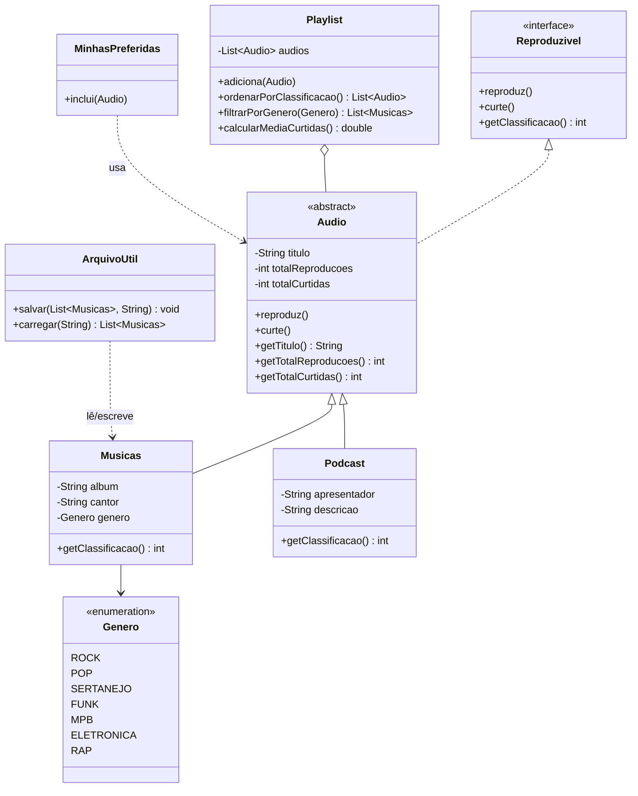

<div align="center">

# 🎧 Minhas Músicas — Media Manager POO

**Gerenciador de mídias de áudio (músicas e podcasts) em Java, construído para demonstrar os quatro pilares da Programação Orientada a Objetos na prática.**

[](https://www.oracle.com/java/)
[](https://maven.apache.org/)
[](https://junit.org/junit5/)
[]()

</div>

---

## 📌 Sobre o projeto

**Minhas Músicas** é um sistema de linha de comando (CLI) para catalogar, classificar e organizar conteúdos de áudio — músicas e podcasts — em uma playlist única. O projeto foi desenhado como um estudo de caso de **Orientação a Objetos em Java**, priorizando um modelo de domínio limpo em vez de complexidade acidental: sem framework, sem banco de dados, sem infraestrutura — só o design.

Cada conteúdo cadastrado recebe uma **classificação dinâmica**, calculada por regras próprias de cada tipo de mídia (reproduções para músicas, curtidas para podcasts), e pode ser ordenado, filtrado e persistido em arquivo texto.

> Nome interno do pacote: `br.com.minhasmusicas` — o projeto nasceu focado em músicas e foi estendido para suportar múltiplos tipos de mídia via abstração comum (`Audio`).

---

## 🧠 Conceitos de POO aplicados

Este projeto foi construído explicitamente para exercitar os quatro pilares da orientação a objetos:

| Pilar | Onde aparece |
|---|---|
| **Abstração** | `Audio` é uma classe abstrata que define o que todo conteúdo reproduzível tem em comum (título, reproduções, curtidas), sem se preocupar com os detalhes de cada tipo. |
| **Herança** | `Musicas` e `Podcast` estendem `Audio`, reaproveitando comportamento comum e especializando apenas o que muda (álbum/gênero vs. apresentador/descrição). |
| **Polimorfismo** | `Playlist` manipula uma lista de `Audio` de forma uniforme — `ordenarPorClassificacao()` funciona para músicas e podcasts ao mesmo tempo, cada um calculando sua própria regra de `getClassificacao()`. |
| **Encapsulamento** | Atributos privados com acesso controlado via getters/setters; regras de negócio (ex: cálculo de classificação) ficam dentro da própria classe, não espalhadas pelo código cliente. |
| **Interface** | `Reproduzivel` define o contrato mínimo (`reproduz`, `curte`, `getClassificacao`) que qualquer mídia reproduzível deve cumprir. |

### Regras de classificação (exemplo de polimorfismo em ação)

```java
// Música: classificação depende do número de reproduções
> 200 reproduções → classificação 10
≤ 200 reproduções → classificação 7

// Podcast: classificação depende do número de curtidas
> 500 curtidas → classificação 10
≤ 500 curtidas → classificação 8
```

Cada subtipo implementa sua própria versão de `getClassificacao()` — o restante do sistema (`Playlist`, `MinhasPreferidas`) não precisa saber qual regra está sendo aplicada, apenas confia no contrato da superclasse.

---

## 🗺️ Diagrama de classes



---

## 📂 Estrutura do projeto

```
media-manager-poo/
├── pom.xml
└── src/
    ├── main/java/br/com/minhasmusicas/
    │   ├── main/
    │   │   ├── principal.java       # Ponto de entrada — menu interativo (CLI)
    │   │   ├── Playlist.java        # Coleção de áudios + regras de ordenação/filtro
    │   │   └── ArquivoUtil.java     # Persistência simples em arquivo texto (.txt)
    │   └── modelos/
    │       ├── Reproduzivel.java    # Interface — contrato de mídia reproduzível
    │       ├── Audio.java           # Classe abstrata base
    │       ├── Musicas.java         # Especialização: música
    │       ├── Podcast.java         # Especialização: podcast
    │       ├── Genero.java          # Enum de gêneros musicais
    │       └── MinhasPreferidas.java# Regra de destaque para conteúdos de sucesso
    └── test/java/br/com/minhasmusicas/modelos/
        └── MusicaTest.java          # Testes unitários (JUnit 5)
```

---

## ⚙️ Funcionalidades

O sistema roda via terminal e oferece um menu interativo:

```
===== MINHAS MÚSICAS =====
1 - Cadastrar música
2 - Cadastrar podcast
3 - Ver relatório da playlist
4 - Salvar músicas em arquivo
5 - Carregar músicas de arquivo
0 - Sair
```

- ✅ Cadastro de músicas (título, cantor, álbum, gênero, reproduções, curtidas)
- ✅ Cadastro de podcasts (título, apresentador, descrição, reproduções, curtidas)
- ✅ Relatório com ranking por classificação (do mais bem avaliado ao menos)
- ✅ Cálculo da média de curtidas de toda a playlist
- ✅ Filtro de músicas por gênero musical
- ✅ Exportação e importação de músicas em arquivo `.txt`
- ✅ Validação de entrada numérica (evita crash em input inválido)

---

## 🛠️ Tecnologias utilizadas

- **Java 17**
- **Maven** (gerenciamento de dependências e build)
- **JUnit 5** (testes unitários)
- **Streams API** (ordenação e filtros funcionais em `Playlist`)

---

## 🚀 Como executar

### Pré-requisitos

- [JDK 17+](https://www.oracle.com/java/technologies/downloads/)
- [Maven 3.8+](https://maven.apache.org/download.cgi)

### Passo a passo

```bash
# 1. Clone o repositório
git clone https://github.com/AnaBia-Kurihara/media-manager-poo.git
cd media-manager-poo

# 2. Compile o projeto
mvn compile

# 3. Execute a aplicação
mvn exec:java -Dexec.mainClass="br.com.minhasmusicas.main.principal"
```

> Alternativa: importe o projeto como Maven no IntelliJ IDEA/Eclipse e execute a classe `principal.java` diretamente.

### Executando os testes

```bash
mvn test
```

---

## 🧪 Testes

A classe `MusicaTest` valida a regra de negócio central do domínio — o cálculo de classificação de uma música com base no número de reproduções:

```java
@Test
void classificacaoDeveSerDezQuandoReproducoesMaiorQue200() { ... }

@Test
void classificacaoDeveSerSeteQuandoReproducoesMenorOuIgualA200() { ... }
```

---

## 🗺️ Roadmap / Próximos passos

- [ ] Permitir escolher o gênero no filtro do relatório (hoje é fixo em `SERTANEJO` como exemplo)
- [ ] Persistir também podcasts (hoje `ArquivoUtil` só salva/carrega `Musicas`)
- [ ] Migrar armazenamento de `.txt` para um formato estruturado (JSON) ou banco de dados
- [ ] Adicionar cobertura de testes para `Playlist`, `Podcast` e `MinhasPreferidas`
- [ ] Adicionar arquivo de licença (ex: MIT)

---

## 👩‍💻 Autora

Desenvolvido por **[AnaBia Kurihara](https://github.com/AnaBia-Kurihara)** como projeto de estudo de Programação Orientada a Objetos em Java.

<div align="center">

Se este projeto te ajudou a estudar POO, considere deixar uma ⭐

</div>
